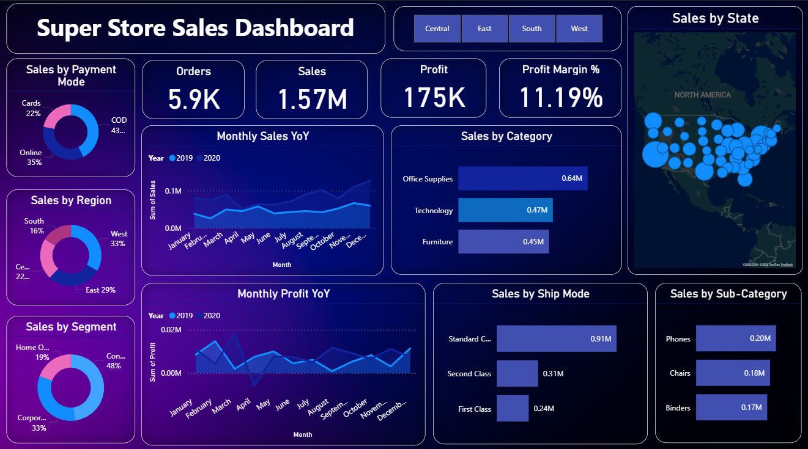

# 📊 Executive Sales Performance Dashboard

An interactive Power BI dashboard built to analyze $1.57M in sales data across 4 regions, tracking 13 KPIs to support data-driven business decisions.

---

## 🛠️ Tools Used
- **Power BI** — Dashboard development & data visualization
- **Microsoft Excel** — Data cleaning, EDA, and Pivot Table analysis

---

## 📁 Files in This Repository
| File | Description |
|------|-------------|
| `Sales_Dashboard_By_Dewan_Sukhani.pbix` | Power BI dashboard file |
| `README.md` | Project documentation |

> **Note:** To open the `.pbix` file, you need [Power BI Desktop](https://powerbi.microsoft.com/desktop/) (free to download).

---

## 📌 Project Overview

This project involves end-to-end analysis of a retail sales dataset worth **$1.57 million**. The goal was to clean, explore, and visualize the data in a way that helps stakeholders quickly identify top-performing regions, categories, and trends.

---

## 🔍 Process

### 1. Data Cleaning & EDA (Excel)
- Removed duplicates, handled missing values, and standardized formats
- Performed Exploratory Data Analysis (EDA) to understand distributions and outliers
- Used **Pivot Tables** to summarize sales by region, category, and time period

### 2. Dashboard Development (Power BI)
- Imported cleaned data into Power BI
- Built an interactive dashboard tracking **13 Key Performance Indicators (KPIs)**
- Added slicers and filters for dynamic exploration by region, category, and date

---

## 📈 Key Findings

| Insight | Detail |
|--------|--------|
| 💰 Total Sales | $1.57 Million |
| 🏆 Top Category | Office Supplies ($0.64M) |
| 🌍 Leading Region | West (33% of total revenue) |
| 📊 KPIs Tracked | 13 across 4 regions |

---

## 🖼️ Dashboard Preview

---

## 👤 Author

**Dewan Sukhani**
BBA Student — Institute of Business Administration (IBA) Karachi

- 📧 dewan.28467@khi.iba.edu.pk
- 🔗 [LinkedIn](https://www.linkedin.com/in/dewan-1a5305277/)

---

## 📄 License
This project is for portfolio and educational purposes.
